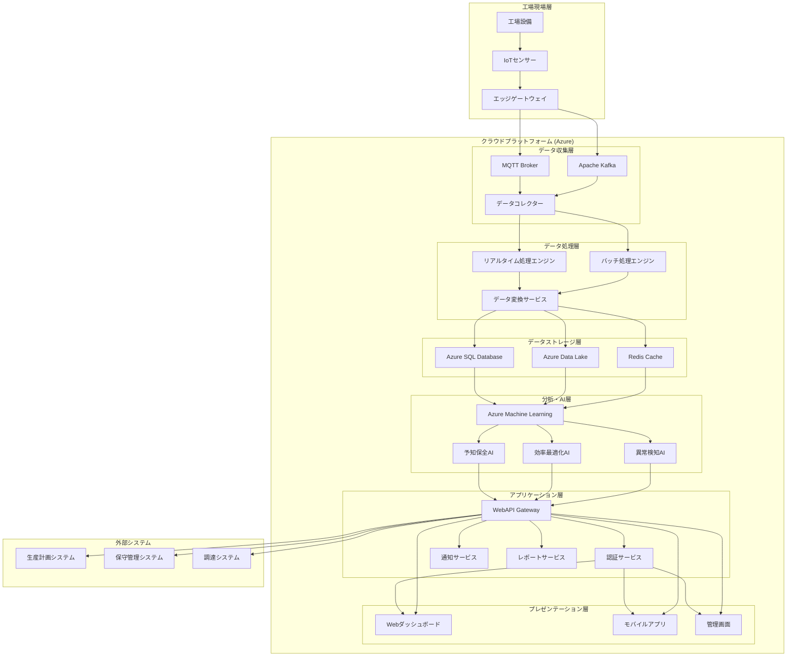
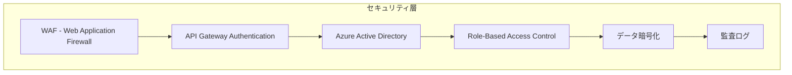
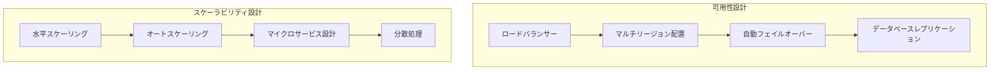

# アプリケーションアーキテクチャ

## 工場設備稼働監視システム アプリケーションアーキテクチャ図

工場設備稼働監視システムの全体的なアプリケーションアーキテクチャをMermaid記法で表現します。

### システム全体構成

### コンポーネント詳細説明

#### 1. 工場現場層
- **工場設備**: 監視対象となる製造設備
- **IoTセンサー**: 温度、振動、圧力等を監視するセンサー群
- **エッジゲートウェイ**: 現場データの前処理とクラウド送信

#### 2. データ収集層
- **MQTT Broker**: IoTデバイスからのリアルタイムデータ受信
- **Apache Kafka**: 大容量データストリーミング処理
- **データコレクター**: 各種データソースからの統合収集

#### 3. データ処理層
- **リアルタイム処理エンジン**: ストリーミングデータのリアルタイム処理
- **バッチ処理エンジン**: 大容量データの定期一括処理
- **データ変換サービス**: データ形式変換と品質管理

#### 4. データストレージ層
- **Azure SQL Database**: 構造化データとトランザクションデータ
- **Azure Data Lake**: 大容量の非構造化データと履歴データ
- **Redis Cache**: 高速アクセス用キャッシュ

#### 5. 分析・AI層
- **Azure Machine Learning**: 機械学習モデルのトレーニングと推論
- **予知保全AI**: 設備故障予測とメンテナンス最適化
- **効率最適化AI**: 生産効率向上のための最適化提案
- **異常検知AI**: リアルタイム異常検知と早期警告

#### 6. アプリケーション層
- **WebAPI Gateway**: 各種サービスへの統合アクセスポイント
- **認証サービス**: ユーザー認証とアクセス制御
- **通知サービス**: アラートと通知の配信管理
- **レポートサービス**: 各種レポートの生成と配信

#### 7. プレゼンテーション層
- **Webダッシュボード**: 監視・分析用のWebインターフェース
- **モバイルアプリ**: 現場作業者向けモバイル対応
- **管理画面**: システム管理者向け設定・管理画面

### 技術スタック

#### フロントエンド
- **フレームワーク**: Vue.js 3
- **UI コンポーネント**: Vuetify
- **グラフ表示**: Chart.js, D3.js
- **リアルタイム通信**: WebSocket

#### バックエンド
- **API**: Node.js + Express.js
- **データベース**: Azure SQL Database
- **キャッシュ**: Redis
- **メッセージキュー**: Apache Kafka

#### インフラストラクチャ
- **クラウド**: Microsoft Azure
- **コンテナ**: Docker + Kubernetes (AKS)
- **CI/CD**: Azure DevOps
- **監視**: Azure Monitor

### セキュリティアーキテクチャ

### 可用性とスケーラビリティ

