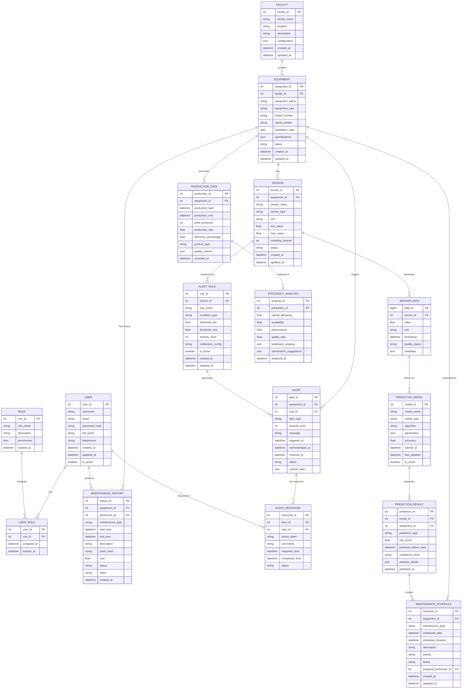
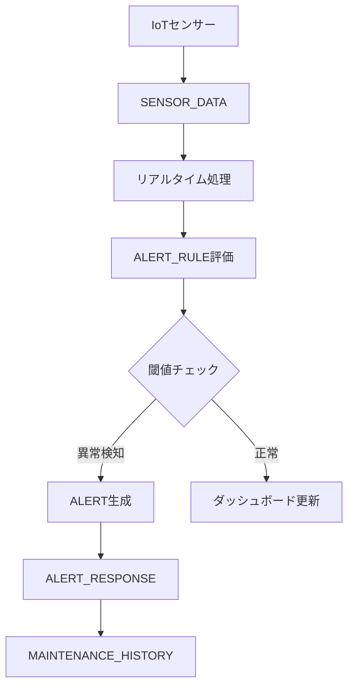
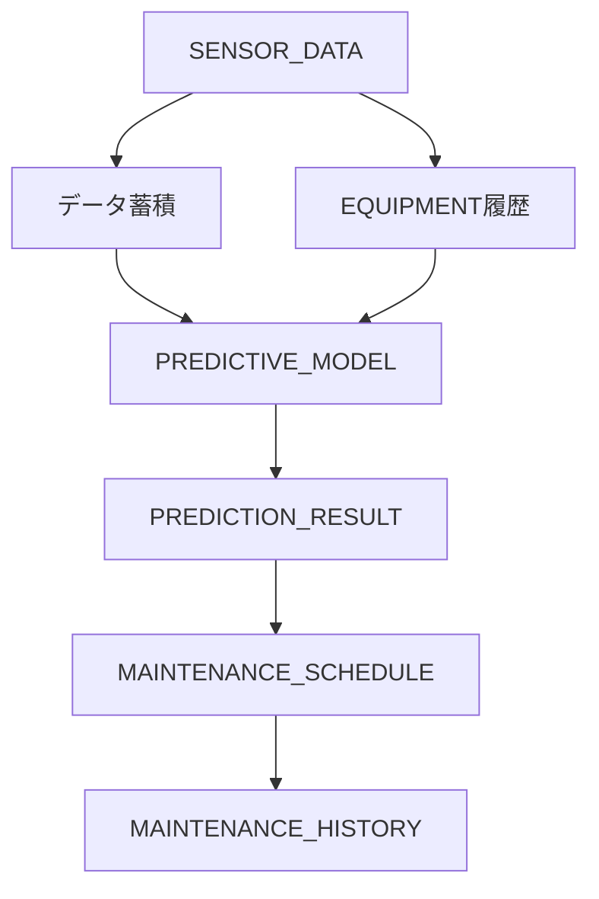
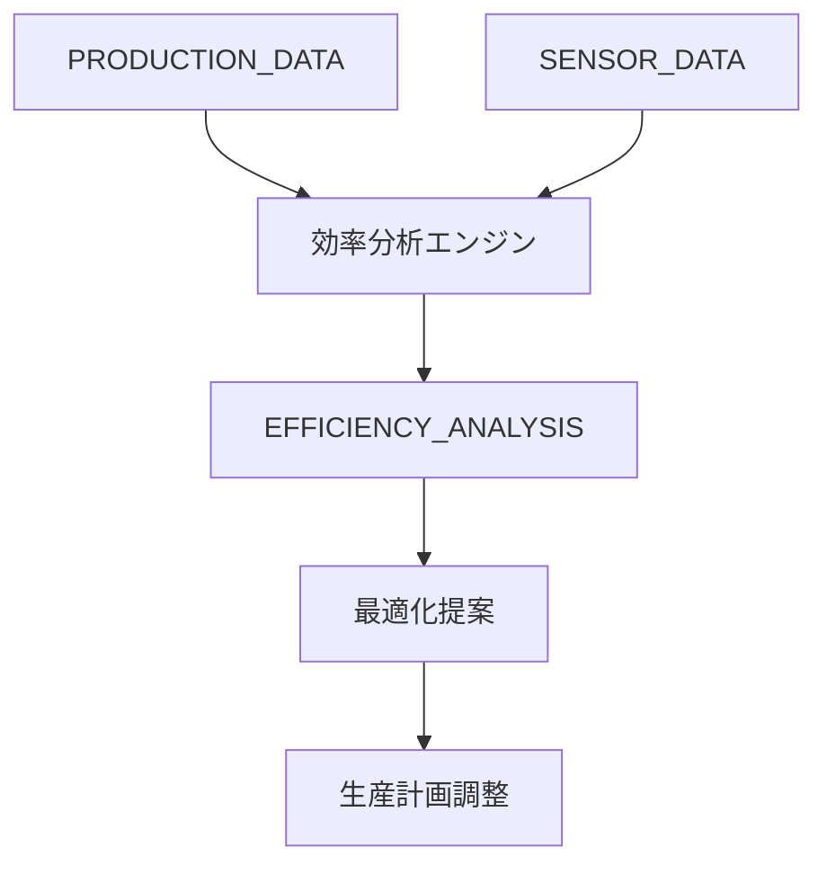
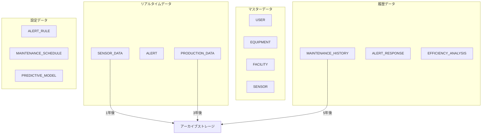
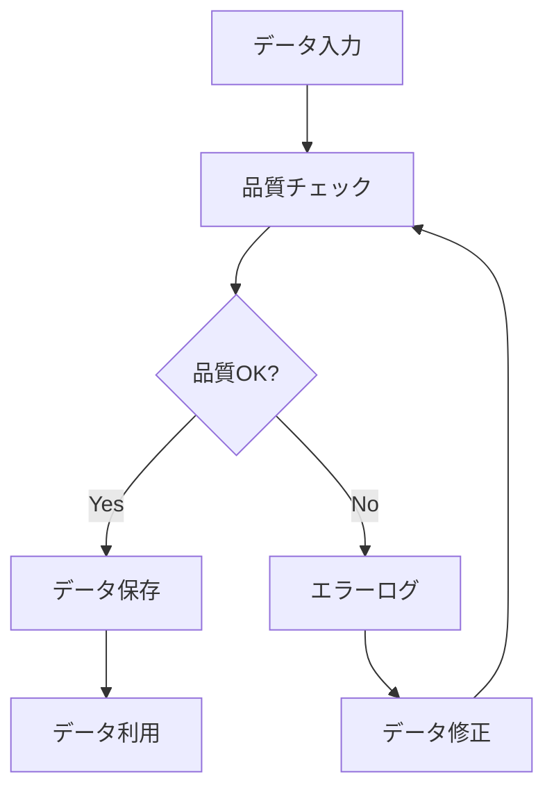
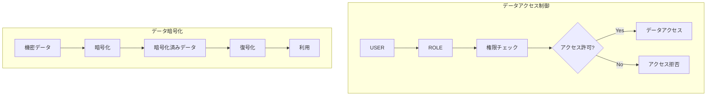
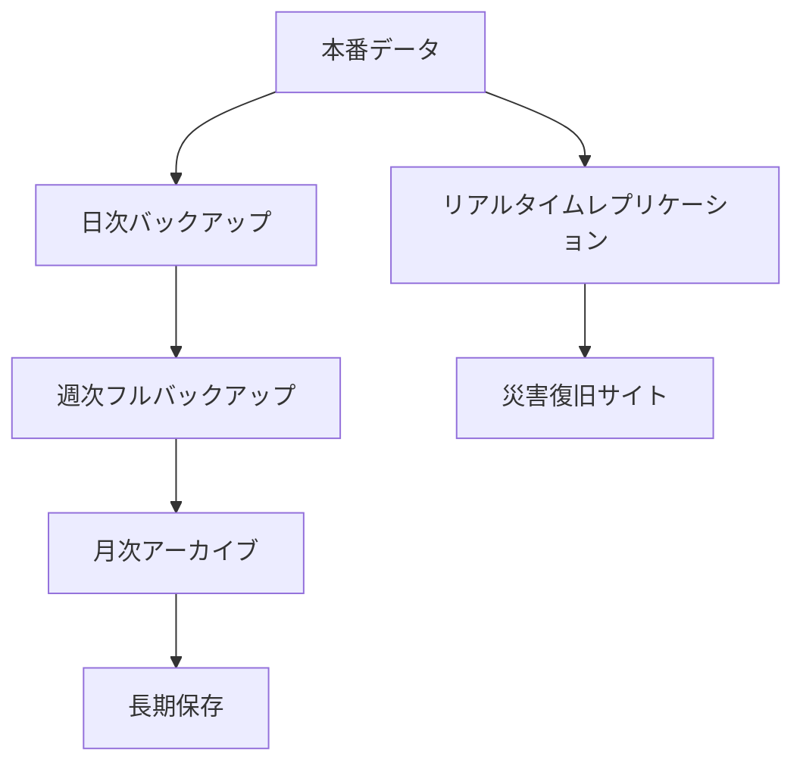

# データモデル

## 工場設備稼働監視システム データモデル設計

工場設備稼働監視システムの全ユースケースを網羅するデータモデルをMermaid記法で表現します。

### 全体ER図

### ユースケース別データフロー

#### 1. リアルタイム設備監視データフロー

#### 2. 予知保全データフロー

#### 3. 生産効率最適化データフロー

### データ分類とライフサイクル

### データ品質管理

### セキュリティとアクセス制御

### データバックアップ戦略

