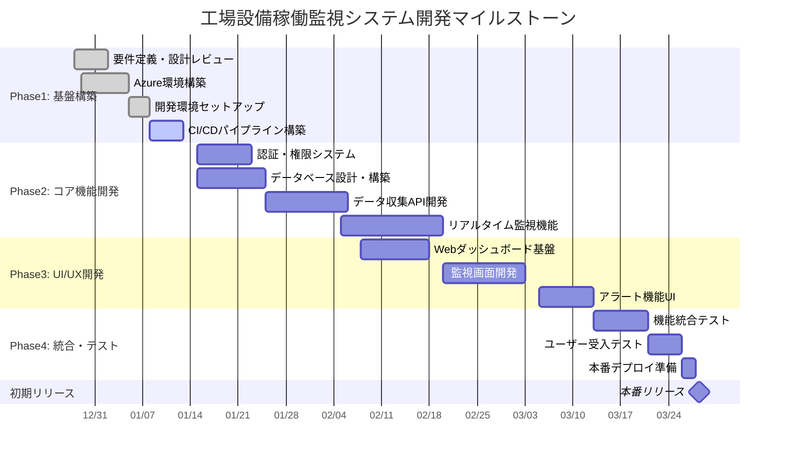
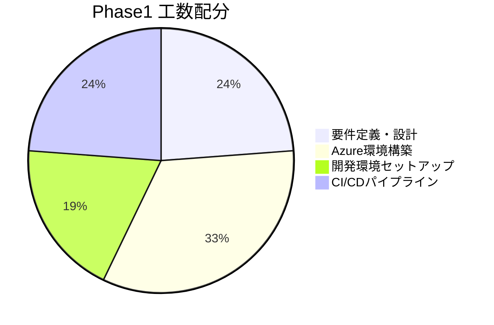
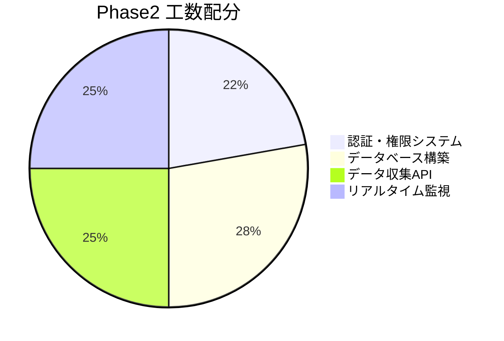
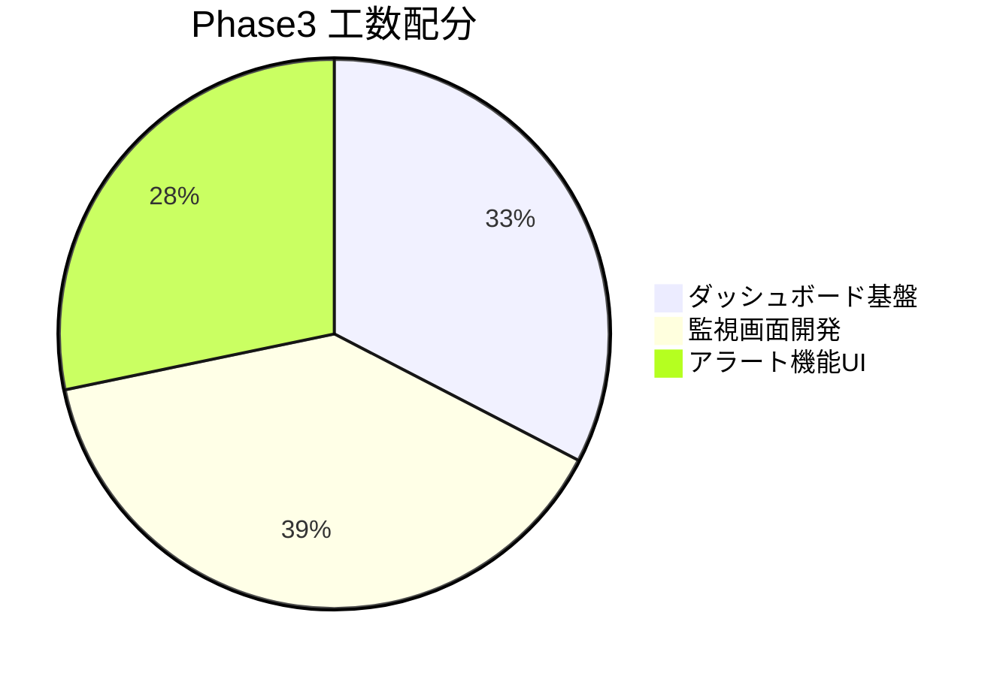
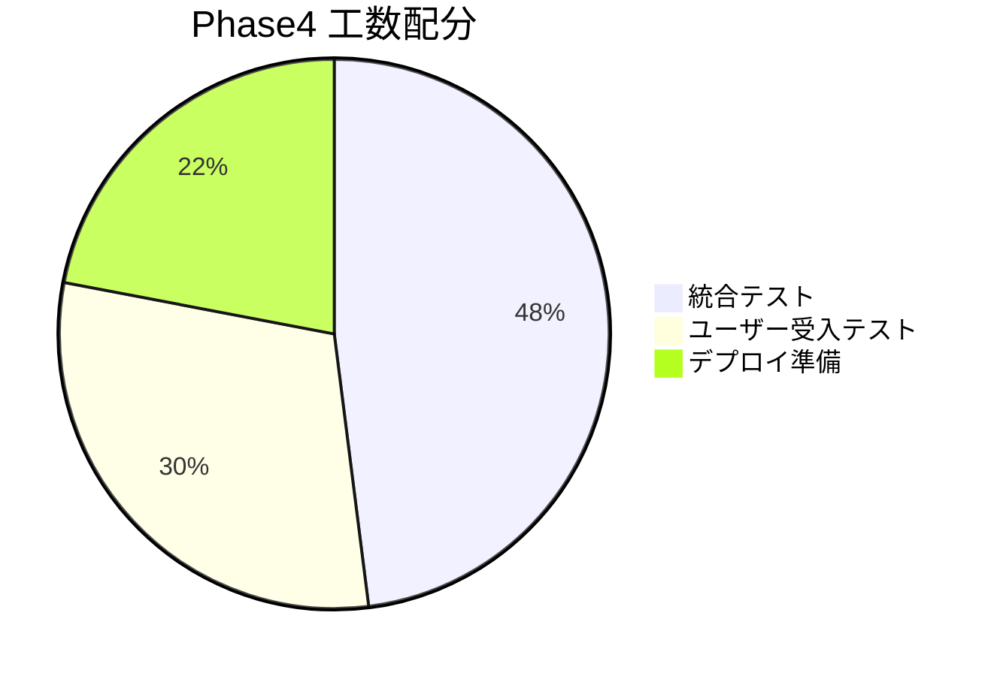
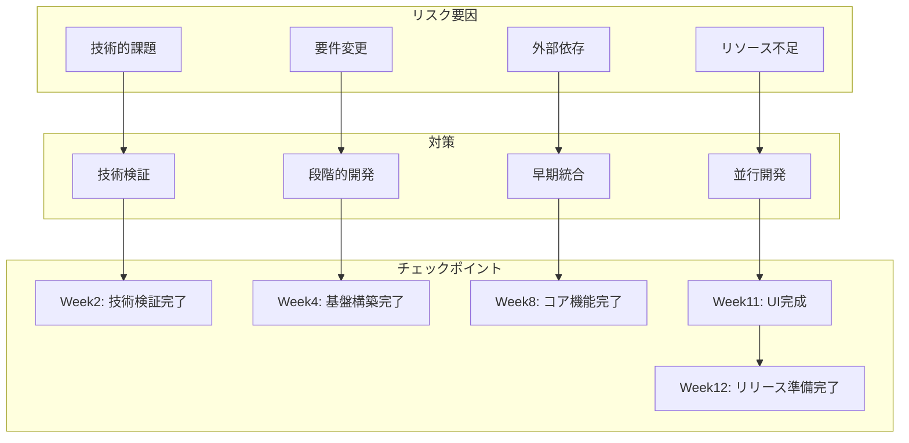
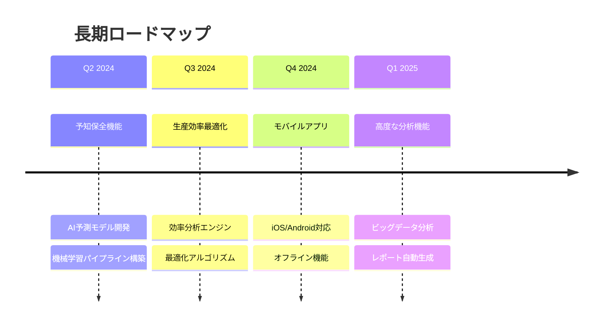

# プロジェクトマイルストーン

## 工場設備稼働監視システム プロジェクトマイルストーン計画

### リソース状況と制約条件

- **案件開始日**: 2023年12月28日
- **初期リリース目標**: 3ヶ月後（2024年3月28日）
- **開発者数**: 3名
- **平均稼働率**: 90%
- **稼働日**: 平日のみ（土日祝日除く）

### 稼働日数計算

```
2023年12月: 2日（12/29、12/30のみ）
2024年1月: 20日（土日祝日除く）
2024年2月: 20日（土日祝日除く）
2024年3月: 20日（12日まで + 3/15～3/28で14日）
合計稼働日数: 62日

総工数: 62日 × 3名 × 8時間 × 0.9（稼働率） = 1,339.2時間
```

### 初期リリース機能優先順位

#### 最優先機能（初期リリース必須）
1. **ユーザー認証・権限管理**
2. **リアルタイム設備監視**
3. **基本的なアラート機能**
4. **データ収集基盤**
5. **Webダッシュボード（基本機能）**

### マイルストーン全体計画



### 詳細工数見積もりと計算過程

#### Phase1: 基盤構築（計画工数: 168時間）



**計算過程:**
- 要件定義・設計: 5日 × 1名 × 8時間 = 40時間
- Azure環境構築: 7日 × 1名 × 8時間 = 56時間
- 開発環境: 4日 × 1名 × 8時間 = 32時間
- CI/CD: 5日 × 1名 × 8時間 = 40時間

#### Phase2: コア機能開発（計画工数: 576時間）



**計算過程:**
- 認証システム: 8日 × 2名 × 8時間 = 128時間
- データベース: 10日 × 2名 × 8時間 = 160時間
- データ収集API: 9日 × 2名 × 8時間 = 144時間
- 監視機能: 9日 × 2名 × 8時間 = 144時間

#### Phase3: UI/UX開発（計画工数: 368時間）



**計算過程:**
- ダッシュボード基盤: 10日 × 1.5名 × 8時間 = 120時間
- 監視画面: 12日 × 1.5名 × 8時間 = 144時間
- アラートUI: 8日 × 1.5名 × 8時間 = 96時間 + バッファ8時間 = 104時間

#### Phase4: 統合・テスト（計画工数: 200時間）



**計算過程:**
- 統合テスト: 8日 × 1.5名 × 8時間 = 96時間
- UAT: 5日 × 1.5名 × 8時間 = 60時間
- デプロイ準備: 2日 × 2.75名 × 8時間 = 44時間

### 総工数検証

```
Phase1: 168時間
Phase2: 576時間  
Phase3: 368時間
Phase4: 200時間
合計: 1,312時間

利用可能工数: 1,339.2時間
バッファ: 27.2時間（約2%）
```

### リスク管理とマイルストーン



### 各フェーズの成果物とゲート判定

#### Phase1 完了条件
- ✅ Azure環境が正常に構築済み
- ✅ 開発環境が全メンバーでセットアップ完了
- ✅ CI/CDパイプラインで自動ビルド・テストが実行可能
- ✅ データベーススキーマ設計が承認済み

#### Phase2 完了条件
- ✅ ユーザー認証機能が動作
- ✅ 基本的なCRUD操作が可能
- ✅ センサーデータの受信・保存が正常に動作
- ✅ リアルタイムデータ処理が安定稼働

#### Phase3 完了条件
- ✅ 主要画面が完成し、基本操作が可能
- ✅ ダッシュボードでリアルタイムデータ表示
- ✅ アラート通知機能が動作
- ✅ レスポンシブデザインの実装完了

#### Phase4 完了条件
- ✅ 全機能の結合テスト完了
- ✅ ユーザー受入テスト合格
- ✅ 本番環境でのデプロイ検証完了
- ✅ 運用手順書・マニュアル作成完了

### 次期フェーズ計画（v2.0）



### まとめ

初期リリース（v1.0）では、最小限の機能セット（MVP: Minimum Viable Product）に集中し、確実な3ヶ月でのリリースを目指します。

**重要な制約条件:**
- 限られた開発期間（3ヶ月）
- 少数精鋭の開発チーム（3名）
- 高い品質要求

**成功の鍵:**
- 優先順位の明確化
- 段階的な開発とテスト
- 継続的な品質管理
- チーム間の密な連携