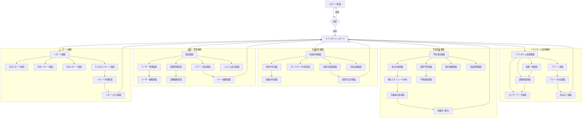
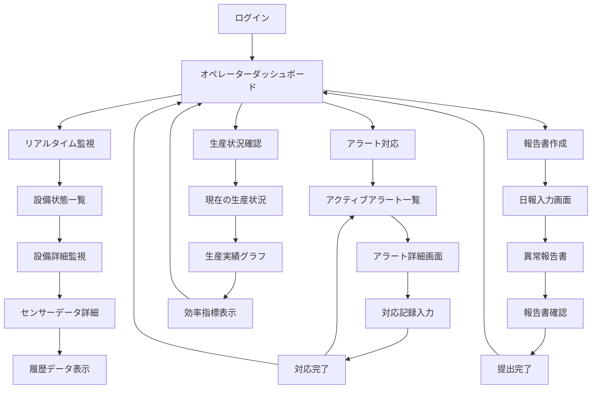
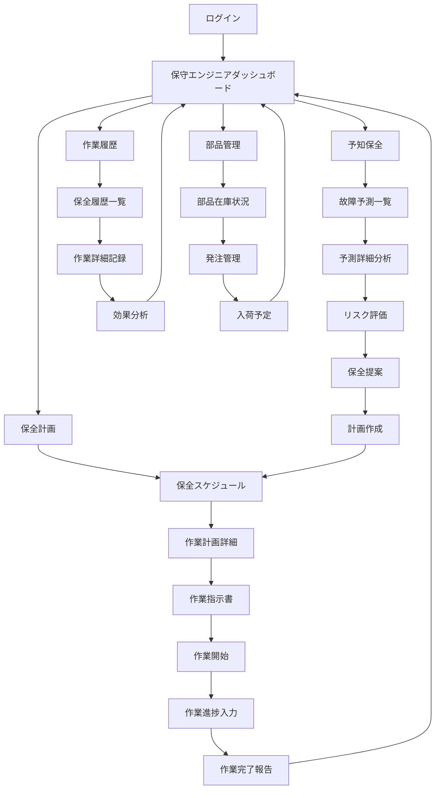
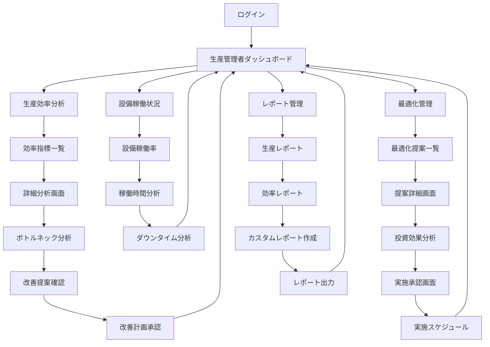
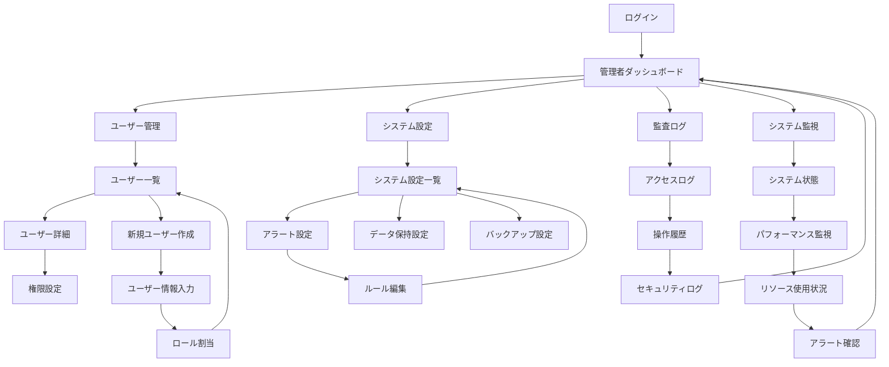
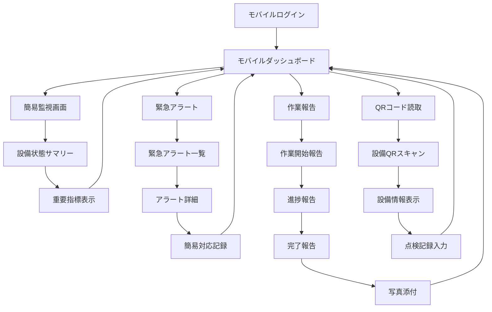
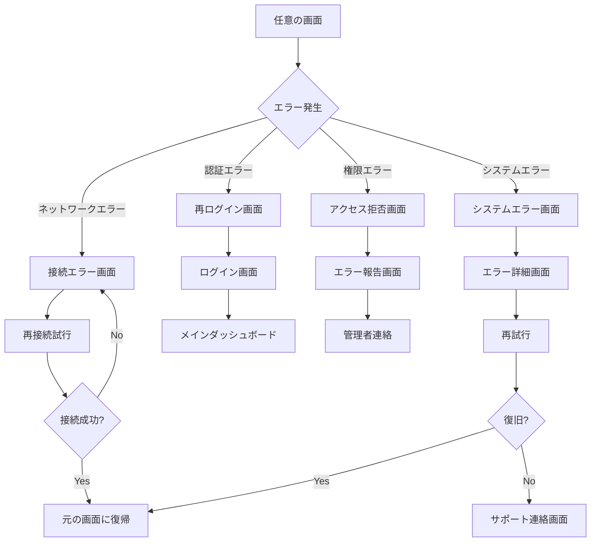

# 画面遷移図

## 工場設備稼働監視システム ユーザー画面遷移図

ユーザーの役割別画面遷移図をMermaid記法で表現します。

### 全体画面遷移図

```mermaid
graph TB
    A[ログイン画面] --> B{認証}
    B -->|成功| C[メインダッシュボード]
    B -->|失敗| A
    
    C --> D[リアルタイム監視画面]
    C --> E[予知保全画面]
    C --> F[生産効率画面]
    C --> G[設定画面]
    C --> H[レポート画面]
    
    subgraph "リアルタイム監視機能"
        D --> D1[設備一覧画面]
        D --> D2[設備詳細画面]
        D --> D3[アラート画面]
        D --> D4[センサーデータ画面]
        
        D1 --> D2
        D2 --> D4
        D3 --> D5[アラート対応画面]
        D5 --> D6[対応完了画面]
    end
    
    subgraph "予知保全機能"
        E --> E1[保全計画画面]
        E --> E2[故障予測画面]
        E --> E3[保全履歴画面]
        E --> E4[部品管理画面]
        
        E1 --> E5[保全スケジュール作成]
        E2 --> E6[予測詳細画面]
        E5 --> E7[作業指示書画面]
        E7 --> E8[作業完了報告]
    end
    
    subgraph "生産効率機能"
        F --> F1[効率分析画面]
        F --> F2[ボトルネック分析画面]
        F --> F3[最適化提案画面]
        F --> F4[生産実績画面]
        
        F1 --> F5[詳細分析画面]
        F3 --> F6[最適化実行画面]
    end
    
    subgraph "設定・管理機能"
        G --> G1[ユーザー管理画面]
        G --> G2[設備管理画面]
        G --> G3[アラート設定画面]
        G --> G4[システム設定画面]
        
        G1 --> G5[ユーザー編集画面]
        G2 --> G6[設備編集画面]
        G3 --> G7[ルール編集画面]
    end
    
    subgraph "レポート機能"
        H --> H1[日次レポート画面]
        H --> H2[月次レポート画面]
        H --> H3[年次レポート画面]
        H --> H4[カスタムレポート画面]
        
        H4 --> H5[レポート作成画面]
        H5 --> H6[レポート出力画面]
    end
    
    D6 --> C
    E8 --> C
    F6 --> C
    G7 --> C
    H6 --> C
```

### 工場オペレーター用画面遷移

```mermaid
graph TB
    A[ログイン] --> B[オペレーターダッシュボード]
    
    B --> C[リアルタイム監視]
    B --> D[アラート対応]
    B --> E[生産状況確認]
    B --> F[報告書作成]
    
    C --> C1[設備状態一覧]
    C1 --> C2[設備詳細監視]
    C2 --> C3[センサーデータ詳細]
    C3 --> C4[履歴データ表示]
    
    D --> D1[アクティブアラート一覧]
    D1 --> D2[アラート詳細画面]
    D2 --> D3[対応記録入力]
    D3 --> D4[対応完了]
    D4 --> D1
    
    E --> E1[現在の生産状況]
    E1 --> E2[生産実績グラフ]
    E2 --> E3[効率指標表示]
    
    F --> F1[日報入力画面]
    F1 --> F2[異常報告書]
    F2 --> F3[報告書確認]
    F3 --> F4[提出完了]
    
    D4 --> B
    E3 --> B
    F4 --> B
```

### 保守エンジニア用画面遷移

```mermaid
graph TB
    A[ログイン] --> B[保守エンジニアダッシュボード]
    
    B --> C[予知保全]
    B --> D[保全計画]
    B --> E[作業履歴]
    B --> F[部品管理]
    
    C --> C1[故障予測一覧]
    C1 --> C2[予測詳細分析]
    C2 --> C3[リスク評価]
    C3 --> C4[保全提案]
    C4 --> C5[計画作成]
    
    D --> D1[保全スケジュール]
    D1 --> D2[作業計画詳細]
    D2 --> D3[作業指示書]
    D3 --> D4[作業開始]
    D4 --> D5[作業進捗入力]
    D5 --> D6[作業完了報告]
    
    E --> E1[保全履歴一覧]
    E1 --> E2[作業詳細記録]
    E2 --> E3[効果分析]
    
    F --> F1[部品在庫状況]
    F1 --> F2[発注管理]
    F2 --> F3[入荷予定]
    
    C5 --> D1
    D6 --> B
    E3 --> B
    F3 --> B
```

### 生産管理者用画面遷移

```mermaid
graph TB
    A[ログイン] --> B[生産管理者ダッシュボード]
    
    B --> C[生産効率分析]
    B --> D[設備稼働状況]
    B --> E[最適化管理]
    B --> F[レポート管理]
    
    C --> C1[効率指標一覧]
    C1 --> C2[詳細分析画面]
    C2 --> C3[ボトルネック分析]
    C3 --> C4[改善提案確認]
    C4 --> C5[改善計画承認]
    
    D --> D1[設備稼働率]
    D1 --> D2[稼働時間分析]
    D2 --> D3[ダウンタイム分析]
    
    E --> E1[最適化提案一覧]
    E1 --> E2[提案詳細画面]
    E2 --> E3[投資効果分析]
    E3 --> E4[実施承認画面]
    E4 --> E5[実施スケジュール]
    
    F --> F1[生産レポート]
    F1 --> F2[効率レポート]
    F2 --> F3[カスタムレポート作成]
    F3 --> F4[レポート出力]
    
    C5 --> B
    D3 --> B
    E5 --> B
    F4 --> B
```

### システム管理者用画面遷移

```mermaid
graph TB
    A[ログイン] --> B[管理者ダッシュボード]
    
    B --> C[ユーザー管理]
    B --> D[システム設定]
    B --> E[監査ログ]
    B --> F[システム監視]
    
    C --> C1[ユーザー一覧]
    C1 --> C2[ユーザー詳細]
    C2 --> C3[権限設定]
    C1 --> C4[新規ユーザー作成]
    C4 --> C5[ユーザー情報入力]
    C5 --> C6[ロール割当]
    
    D --> D1[システム設定一覧]
    D1 --> D2[アラート設定]
    D1 --> D3[データ保持設定]
    D1 --> D4[バックアップ設定]
    D2 --> D5[ルール編集]
    
    E --> E1[アクセスログ]
    E1 --> E2[操作履歴]
    E2 --> E3[セキュリティログ]
    
    F --> F1[システム状態]
    F1 --> F2[パフォーマンス監視]
    F2 --> F3[リソース使用状況]
    F3 --> F4[アラート確認]
    
    C6 --> C1
    D5 --> D1
    E3 --> B
    F4 --> B
```

### モバイル版画面遷移

```mermaid
graph TB
    A[モバイルログイン] --> B[モバイルダッシュボード]
    
    B --> C[簡易監視画面]
    B --> D[緊急アラート]
    B --> E[作業報告]
    B --> F[QRコード読取]
    
    C --> C1[設備状態サマリー]
    C1 --> C2[重要指標表示]
    
    D --> D1[緊急アラート一覧]
    D1 --> D2[アラート詳細]
    D2 --> D3[簡易対応記録]
    
    E --> E1[作業開始報告]
    E1 --> E2[進捗報告]
    E2 --> E3[完了報告]
    E3 --> E4[写真添付]
    
    F --> F1[設備QRスキャン]
    F1 --> F2[設備情報表示]
    F2 --> F3[点検記録入力]
    
    C2 --> B
    D3 --> B
    E4 --> B
    F3 --> B
```

### エラーハンドリング画面遷移

```mermaid
graph TB
    A[任意の画面] --> B{エラー発生}
    
    B -->|ネットワークエラー| C[接続エラー画面]
    B -->|認証エラー| D[再ログイン画面]
    B -->|権限エラー| E[アクセス拒否画面]
    B -->|システムエラー| F[システムエラー画面]
    
    C --> G[再接続試行]
    G --> H{接続成功?}
    H -->|Yes| I[元の画面に復帰]
    H -->|No| C
    
    D --> J[ログイン画面]
    J --> K[メインダッシュボード]
    
    E --> L[エラー報告画面]
    L --> M[管理者連絡]
    
    F --> N[エラー詳細画面]
    N --> O[再試行]
    O --> P{復旧?}
    P -->|Yes| I
    P -->|No| Q[サポート連絡画面]
```